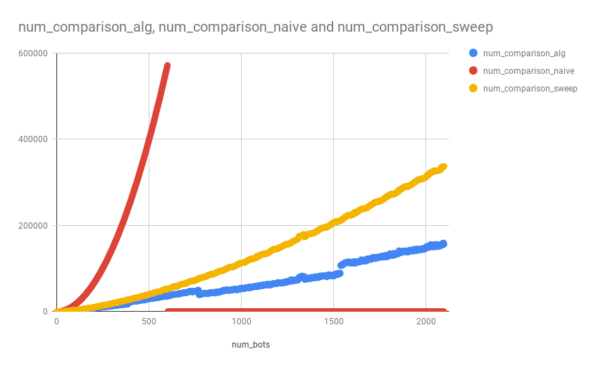
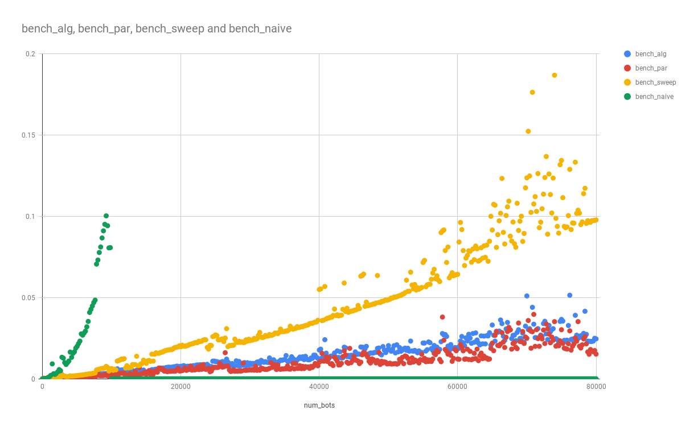
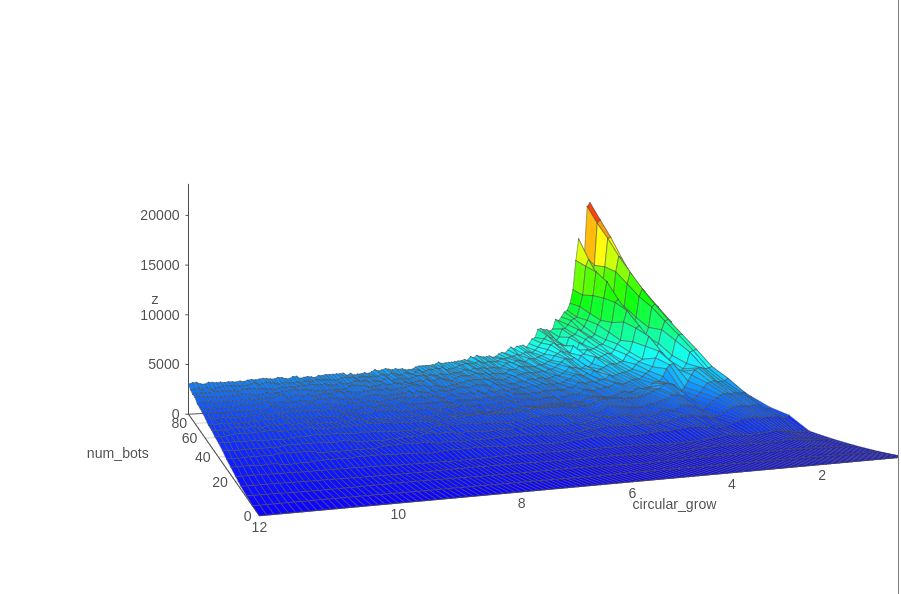
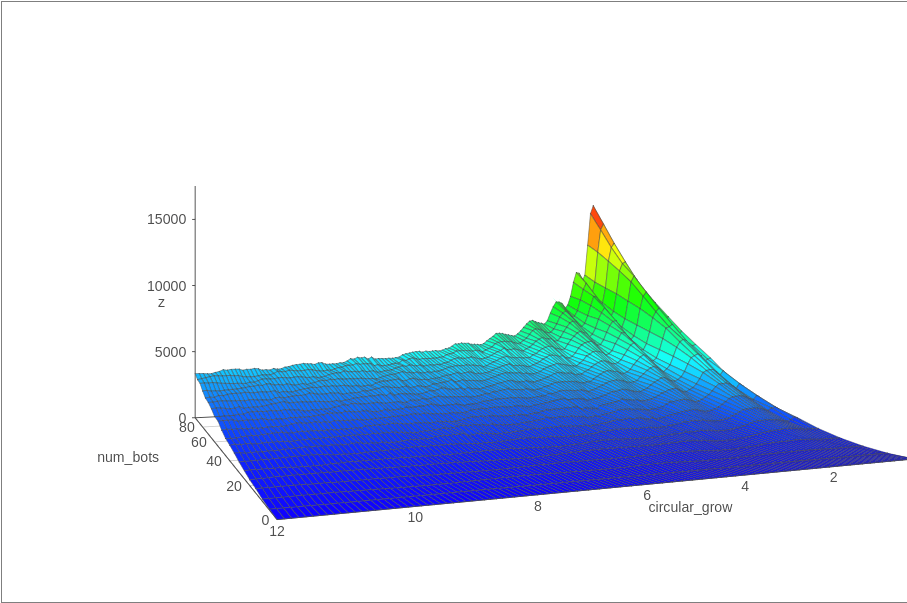

An iterative mulithreaded hybrid kdtree/mark and sweep algorithm used for broadphase detection.

# Goal
Create a fast and simple to use broad-phase collision system whose running time did not depend on the size of the 2d space
in which the collision finding functionality was being provided. Does not suffer from "teapot in a stadium" problem.

# Graphs

This shows the number of comparisions of each algorithm. The naive pair finding algorithm grows so fast that I stopped computing it early on. The sweep and prune algorithm does much better than the naive. The dinotree version does even better. The sporadic jumps in the dinotree algorithm correspond to the points where the height of the tree increased by one.

Unlike the previous graph, this one measure computation time. So this data is very hardware dependent. This data was captured on a dual core dell xps 13 laptop. The same trends as those in the comparison graph are present.

The above graph shows how

## License

Licensed under the terms of MIT license and the Apache License (Version 2.0).

See [LICENSE-MIT](LICENSE-MIT) and [LICENSE-APACHE](LICENSE-APACHE) for details.
